#  Customer Purchase Prediction System with MLOps

A MLOps pipeline that transforms e-commerce behavior data into real-time purchase predictions. Built on modern open-source technologies including Kafka, Flink, Spark, Ray, and MLflow, this project demonstrates a complete ML lifecycle from data ingestion through model deployment. The system features automated CDC, multi-layer data warehousing, real-time feature serving, and comprehensive observability.

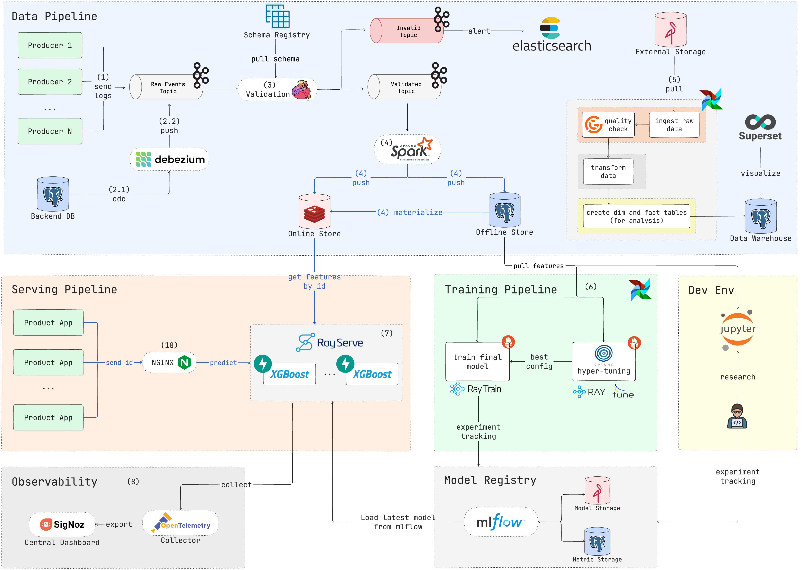

##  Table of Contents

- [ Dataset](#-dataset)
  - [File Structure](#file-structure)
  - [Event Types](#event-types)
  - [Modeling: Customer Purchase Prediction](#modeling-customer-purchase-prediction)
- [ Architecture Overview](#-architecture-overview)
  - [1. Data Pipeline](#1-data-pipeline)
    - [ Data Sources](#-data-sources)
    - [ Schema Validation](#-schema-validation)
    - [ Storage Layer](#-storage-layer)
    - [ Spark Streaming](#-spark-streaming)
  - [2. Training Pipeline](#2-training-pipeline)
    - [ Distributed Training](#-distributed-training)
    - [ Model Management](#-model-management)
  - [3. Serving Pipeline](#3-serving-pipeline)
    - [ Model Serving](#-model-serving)
    - [ Feature Service](#-feature-service)
  - [4. Observability](#4-observability)
    - [ Metrics & Monitoring](#-metrics--monitoring)
    - [ Access Management](#-access-management)
- [ Details](#-details)
  - [ Setup Environment Variables](#-setup-environment-variables)
  - [ Start Data Pipeline](#-start-data-pipeline)
  - [ Start Schema Validation Job](#-start-schema-validation-job)
  - [ Start Data Lake](#-start-data-lake)
  - [ Start Orchestration](#-start-orchestration)
  - [Data and Training Pipeline](#data-and-training-pipeline)
    - [ Data Pipeline](#-data-pipeline-1)
    - [ Training Pipeline](#-training-pipeline-1)
    - [ Start Online Store](#-start-online-store)
  - [ Start Serving Pipeline](#-start-serving-pipeline)
  - [ Start Observability](#-start-observability)
    - [ SigNoz](#-signoz)
    - [ Prometheus and Grafana](#-prometheus-and-grafana)
  - [ NGINX](#-nginx)
- [Contributing](#contributing)
- [ License](#-license)

##  Dataset

> eCommerce Behavior Data from Multi Category Store

The dataset can be found [here](https://www.kaggle.com/datasets/mkechinov/ecommerce-behavior-data-from-multi-category-store/data). This dataset contains behavior data from over 285 million user events on a large multi-category eCommerce website.

The data spans 7 months (October 2019 to April 2020) and captures user-product interactions like views, cart additions/removals, and purchases. Each event represents a many-to-many relationship between users and products.

The dataset was collected by the Open CDP project, an open source customer data platform that enables tracking and analysis of user behavior data.

### File Structure

| Field         | Description                                                          |
| ------------- | -------------------------------------------------------------------- |
| event_time    | UTC timestamp when the event occurred                                |
| event_type    | Type of user interaction event                                       |
| product_id    | Unique identifier for the product                                    |
| category_id   | Product category identifier                                          |
| category_code | Product category taxonomy (when available for meaningful categories) |
| brand         | Brand name (lowercase, may be missing)                               |
| price         | Product price (float)                                                |
| user_id       | Permanent user identifier                                            |
| user_session  | Temporary session ID that changes after long user inactivity         |

### Event Types

The dataset captures four types of user interactions:

- **view**: User viewed a product
- **cart**: User added a product to shopping cart
- **remove_from_cart**: User removed a product from shopping cart
- **purchase**: User purchased a product

### Modeling: Customer Purchase Prediction

The core modeling task is to predict whether a user will purchase a product at the moment they add it to their shopping cart.

#### Feature Engineering

We transform the raw event data into meaningful features for our machine learning model. The analysis focuses specifically on cart addition events and their subsequent outcomes.

Key engineered features include:

| Feature              | Description                                                 |
| -------------------- | ----------------------------------------------------------- |
| category_code_level1 | Main product category                                       |
| category_code_level2 | Product sub-category                                        |
| event_weekday        | Day of week when cart addition occurred                     |
| activity_count       | Total user activities in the current session                |
| price                | Original product price                                      |
| brand                | Product brand name                                          |
| is_purchased         | Target variable: whether cart item was eventually purchased |

You can download the dataset and put it under the `data` folder.

##  Architecture Overview

The system comprises four main components—**Data**, **Training**, **Serving**, and **Observability**—alongside a **Dev Environment** and a **Model Registry**.

### 1. Data Pipeline

####  Data Sources

- **Kafka Producer**: Continuously emits user behavior events to `tracking.raw_user_behavior` topic
- **CDC Service**: Uses Debezium to capture PostgreSQL changes, streaming to `tracking_postgres_cdc.public.events`

####  Schema Validation

- Validates incoming events from both sources
- Routes events to:
  - `tracking.user_behavior.validated` for valid events
  - `tracking.user_behavior.invalid` for schema violations
- Handles ~10k events/second
- Alerts invalid events to Elasticsearch

####  Storage Layer

- **Data Lake (MinIO)**:
  - External Storage
  - Stores data in time-partitioned buckets (year/month/day/hour)
  - Supports checkpointing for pipeline resilience
- **Data Warehouse (PostgreSQL)**:
  - Organized in bronze → silver → gold layers
  - Houses dimension/fact tables for analysis purposes
- **Offline Store (PostgreSQL)**:
  - Used for training and batch feature serving
  - Periodically materialized to online store
- **Online Store (Redis)**:
  - Low-latency feature serving
  - Updated through streaming pipeline
  - Exposed via Feature Retrieval API

####  Spark Streaming

- Transforms validated events into ML features
- Focuses on session-based metrics and purchase behavior
- Dual-writes to online/offline stores

### 2. Training Pipeline

####  Distributed Training

- **Ray Cluster**:
  - Handles distributed hyperparameter tuning via Ray Tune
  - Executes final model training
  - Integrates with MLflow for experiment tracking

####  Model Management

- **MLflow + MinIO + PostgreSQL**:
  - Tracks experiments, parameters, and metrics
  - Versions model artifacts
  - Provides model registry UI at `localhost:5001`

### 3. Serving Pipeline

####  Model Serving

- **Ray Serve**:
  - Loads models from MLflow registry
  - Automatically scales horizontally for high throughput
  - Provides REST API for predictions
- **Feature Service**:
  - FastAPI endpoint for feature retrieval
  - Integrates with Redis for real-time features

### 4. Observability

####  Metrics & Monitoring

- **SigNoz**:
  - Collects OpenTelemetry data
  - Provides service-level monitoring
  - Accessible at `localhost:3301`
- **Ray Dashboard**:
  - Monitors training/serving jobs
  - Available at `localhost:8265`
- **Prometheus + Grafana**:
  - Tracks Ray cluster metrics
  - Visualizes system performance
  - Accessible at `localhost:3009`
- **Superset**:
  - Visualize the data in the Data Warehouse
  - Accessible at `localhost:8089`
- **Elasticsearch**:
  - Alert invalid events

####  Access Management

- **NGINX Proxy Manager**:
  - Reverse proxy for all services
  - SSL/TLS termination
  - Access control and routing

The architecture prioritizes reliability, scalability, and observability while maintaining clear separation of concerns between pipeline stages. Each component is containerized and can be deployed independently using Docker Compose.

---

##  Details

All available commands can be found in the `Makefile`.

In this section, we will dive into the details of the system.

###  Setup Environment Variables

Please run the following command to setup the `.env` files:

```bash
cp .env.example .env
cp ./src/cdc/.env.example ./src/cdc/.env
cp ./src/model_registry/.env.example ./src/model_registry/.env
cp ./src/orchestration/.env.example ./src/orchestration/.env
cp ./src/producer/.env.example ./src/producer/.env
cp ./src/streaming/.env.example ./src/streaming/.env
```

**Note**: I don't use any secrets in this project, so run the above command and you are good to go.

###  Start Data Pipeline

I will use the same network for all the services, first we need to create the network.

```bash
make up-network
```

####  Start Kafka

```bash
make up-kafka
```

The last service in the `docker-compose.kafka.yaml` file is `kafka_producer`, this service acts as a producer and will start sending messages to the `tracking.raw_user_behavior` topic.

To check if Kafka is running, you can go to `localhost:9021` and you should see the Kafka dashboard. Then go to the `Topics` tab and you should see `tracking.raw_user_behavior` topic.

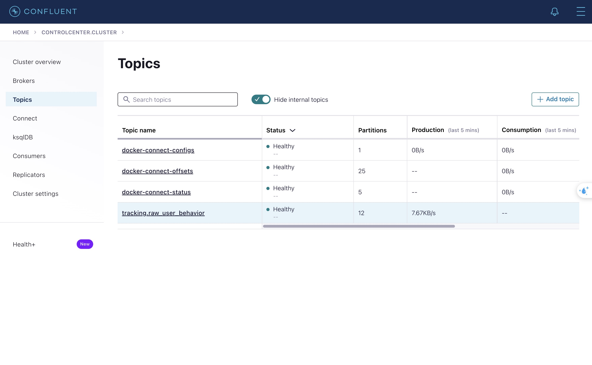

To check if the producer is sending messages, you can click on the `tracking.raw_user_behavior` topic and you should see the messages being sent.

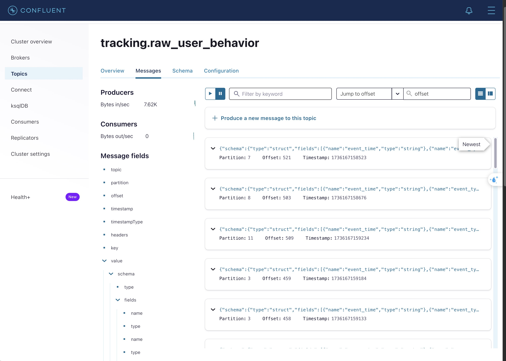

Here is an example of the message's value in the `tracking.raw_user_behavior` topic:

```json
{
  "schema": {
    "type": "struct",
    "fields": [
      {
        "name": "event_time",
        "type": "string"
      },
      {
        "name": "event_type",
        "type": "string"
      },
      {
        "name": "product_id",
        "type": "long"
      },
      {
        "name": "category_id",
        "type": "long"
      },
      {
        "name": "category_code",
        "type": ["null", "string"],
        "default": null
      },
      {
        "name": "brand",
        "type": ["null", "string"],
        "default": null
      },
      {
        "name": "price",
        "type": "double"
      },
      {
        "name": "user_id",
        "type": "long"
      },
      {
        "name": "user_session",
        "type": "string"
      }
    ]
  },
  "payload": {
    "event_time": "2019-10-01 02:30:12 UTC",
    "event_type": "view",
    "product_id": 1306133,
    "category_id": "2053013558920217191",
    "category_code": "computers.notebook",
    "brand": "xiaomi",
    "price": 1029.37,
    "user_id": 512900744,
    "user_session": "76b918d5-b344-41fc-8632-baf222ec760f"
  }
}
```

####  Start CDC (2)

```bash
make up-cdc
```

Next, we start the CDC (Change Data Capture) service using Docker Compose. This setup includes the following components:

- Debezium: Monitors the Backend DB for any changes (inserts, updates, deletes) and captures those changes.
- PostgreSQL: The database where the changes are being monitored.
- A Python service: Registers the connector, creates the table, and inserts the data into PostgreSQL.

Steps involved:

- Debezium monitors the Backend DB for any changes. (2.1)
- Debezium captures these changes and pushes them to the Raw Events Topic in the message broker. (2.2)

The data is automatically synced from PostgreSQL to the `tracking_postgres_cdc.public.events` topic. To confirm this, go to the `Connect` tab in the Kafka UI; you should see a connector named `cdc-postgresql`.

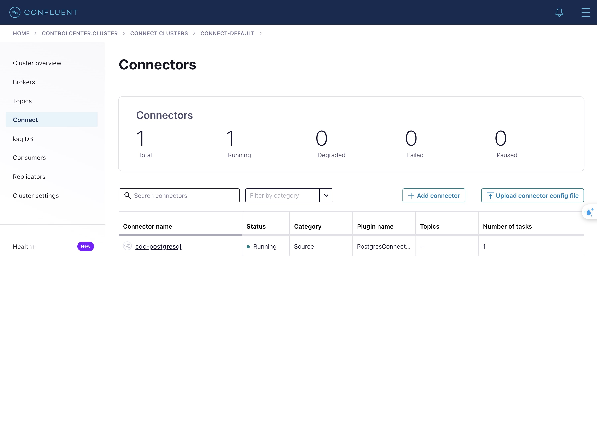

Return to `localhost:9021`; there should be a new topic called `tracking_postgres_cdc.public.events`.

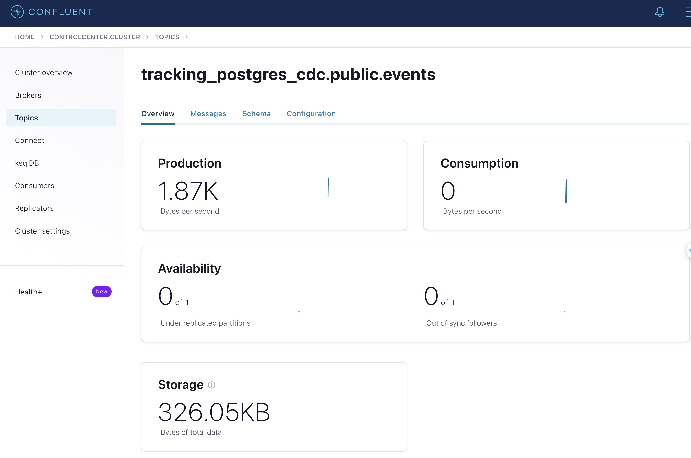

###  Start Schema Validation Job

```bash
make schema_validation
```

This is a Flink job that will consume the `tracking_postgres_cdc.public.events` and `tracking.raw_user_behavior` topics and validate the schema of the events. The validated events will be sent to the `tracking.user_behavior.validated` topic and the invalid events will be sent to the `tracking.user_behavior.invalid` topic, respectively. For easier understanding, I don't push these Flink jobs into a Docker Compose file, but you can do it if you want. Watch the terminal to see the job running, the log may look like this:

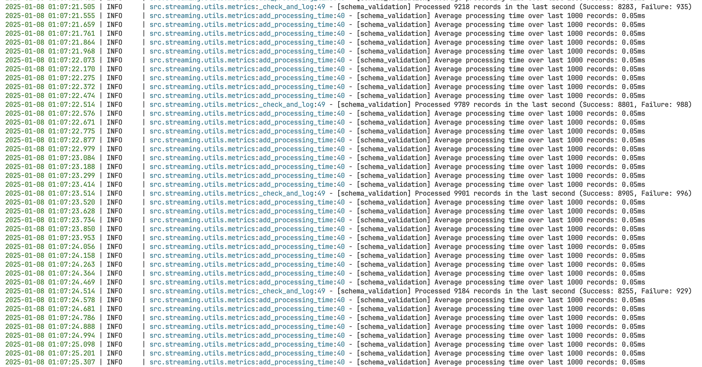

We can handle `10k RPS`, noting that approximately `10%` of events are failures. I purposely make the producer send invalid events to the `tracking.user_behavior.invalid` topic. You can check this at line `127` in `src/producer/produce.py`.

After starting the job, you can go to `localhost:9021` and you should see the `tracking.user_behavior.validated` and `tracking.user_behavior.invalid` topics.

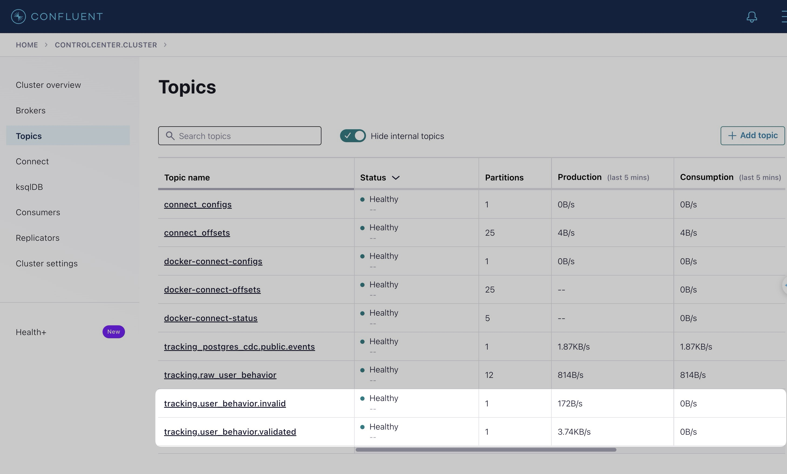

Beside that, we can also start the `alert_invalid_events` job to alert the invalid events.

```bash
make alert_invalid_events
```

**Note**: This feature of pushing the invalid events to **Elasticsearch** is not implemented yet, I will implement it in the future, but you can do it easily by modifying the `src/streaming/jobs/alert_invalid_events_job.py` file.

###  Transformation Job (4)

First, we need to start the Data Warehouse and the Online Store.

```bash
make up-dwh
make up-online-store
```

####  Data Warehouse

The Data Warehouse is just a **PostgreSQL** instance.

####  Online Store

The Online Store is a **Redis** instance.

Look at the `docker-compose.online-store.yaml` file, you will see 2 services, the `redis` service and the `feature-retrieval` service. The `redis` service is the Online Store, and the `feature-retrieval` service is the Feature Retrieval service.

The `feature-retrieval` service is a Python service that will run the following commands:

```bash
python api.py # Start a simple FastAPI app to retrieve the features
```

To view the Swagger UI, you can go to `localhost:8001/docs`. But before that, you need to run the `ingest_stream` job.

####  Spark Streaming Job

Then, we need to start the transformation job.

```bash
make ingest_stream
```

This is a **Spark Streaming** job that consumes events from the `tracking.user_behavior.validated` topic. It transforms raw user behavior data into structured machine learning features, focusing on session-based metrics and purchase behavior. The transformed data is then **pushed to both online and offline feature stores**, enabling real-time and batch feature serving for ML models. Periodically, the data is materialized to the online store.

The terminal will look like this:

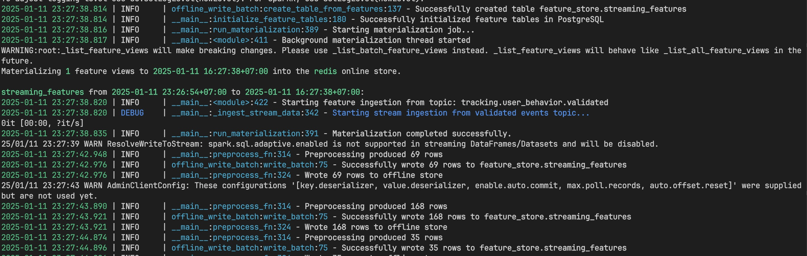

Beside that, you can use any tool to visualize the offline store, for example, you can use `DataGrip` to connect to the `dwh` database and you should see the `feature_store` schema.

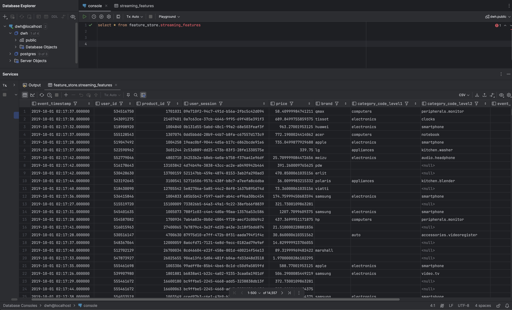

###  Data and Training Pipeline (5 & 6)

```bash
make up-orchestration
```

This will start the Airflow service and the other services that are needed for the orchestration. Here is the list of services that will be started:

- MinIO (Data Lake)
- PostgreSQL (Data Warehouse)
- Ray Cluster
- MLflow (Model Registry)
- Prometheus & Grafana (for Ray monitoring)

**Relevant URLs:**

-  Airflow UI: `localhost:8080` (user/password: `airflow:airflow`)
-  Ray Dashboard: `localhost:8265`
-  Grafana: `localhost:3009` (user/password: `admin:admin`)
-  MLflow UI: `localhost:5001`

Go to the Airflow UI (default user and password is `airflow:airflow`) and you should see the `data_pipeline` and `training_pipeline` DAGs. These 2 DAGs are automatically triggered, but you can also trigger them manually.

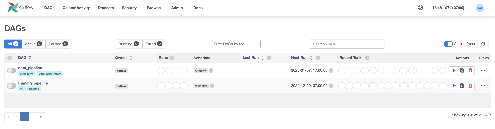

####  Data Pipeline (5)

##### Data Lake

Data from external sources is ingested into the Data Lake, then transformed into a format suitable for the Data Warehouse for analysis purposes.

To make it simple, I used the data from the `tracking.user_behavior.validated` topic in this `data_pipeline` DAG. To end this, we first start the Data Lake, then we create a connector to ingest the data from the `tracking.user_behavior.validated` topic to the Data Lake.

```bash
make up-data-lake
```

The Data Lake is a **MinIO** instance, you can see the UI at `localhost:9001` (user/password: `minioadmin:minioadmin`).

Next, we need to create a connector to ingest the data from the `tracking.user_behavior.validated` topic to the Data Lake.

```bash
make deploy_s3_connector
```

To see the MinIO UI, you can go to `localhost:9001` (default user and password is `minioadmin:minioadmin`). There are 2 buckets, `validated-events-bucket` and `invalidated-events-bucket`, you can go to each bucket and you should see the events being synced.


Each record in buckets is a JSON file, you can click on the file and you should see the event.

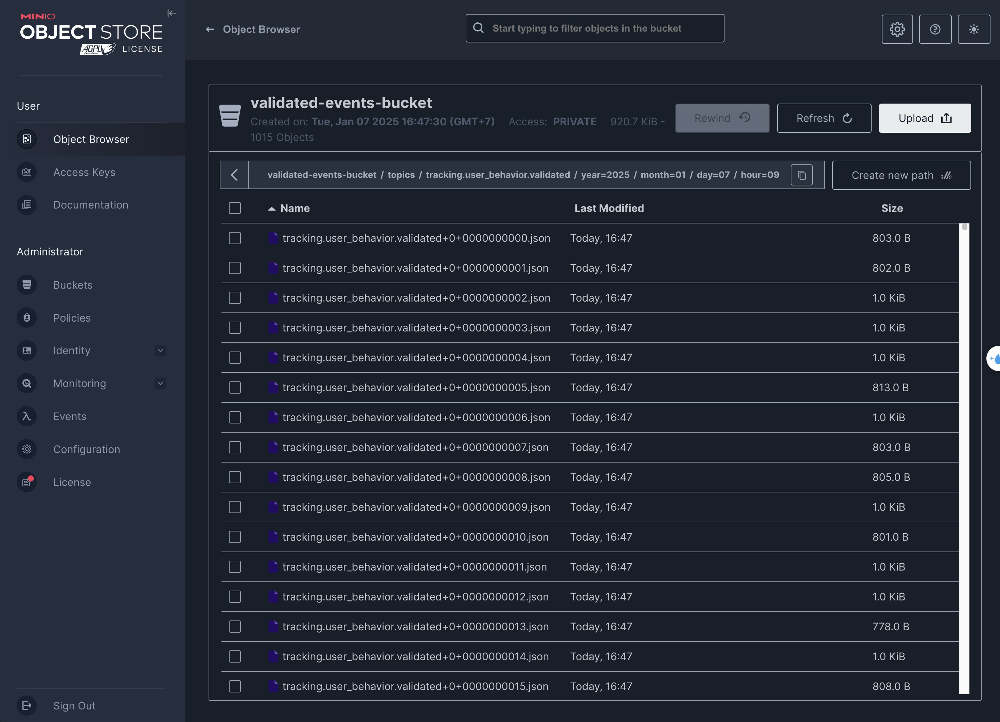

##### Data Pipeline

The `data_pipeline` DAG is divided into three layers:

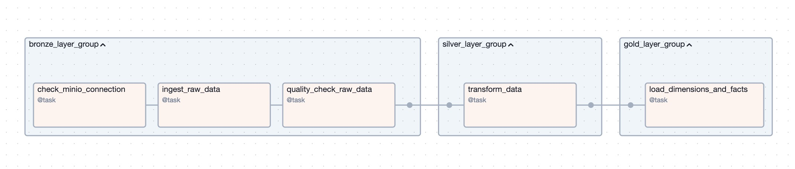

###### Bronze Layer:

1. **ingest_raw_data** - Ingests raw data from the Data Lake.
2. **quality_check_raw_data** - Performs validations on the ingested raw data, ensuring data integrity.

###### Silver Layer:

3. **transform_data** - Cleans and transforms validated raw data, preparing it for downstream usage.

###### Gold Layer:

4. **create dim and fact tables** - Creates dimension and fact tables in the Data Warehouse for analysis.

Trigger the `data_pipeline` DAG, and you should see the tasks running. This DAG will take some time to complete, but you can check the logs in the Airflow UI to monitor the progress. For simplicity, I hardcoded the `MINIO_PATH_PREFIX` to `topics/tracking.user_behavior.validated/year=2025/month=01`. Ideally, you should use the actual timestamp for each run. For example, `validated-events-bucket/topics/tracking.user_behavior.validated/year=2025/month=01/day=07/hour=XX`, where XX is the hour of the day.

I also use checkpointing to ensure the DAG is resilient to failures and can resume from where it left off. The checkpoint is stored in the Data Lake, just under the `MINIO_PATH_PREFIX`, so if the DAG fails, you can simply trigger it again, and it will resume from the last checkpoint.

To visualize the data, you can use **Superset**.

```bash
make up-superset
```

Then go to `localhost:8089` and you should see the Superset dashboard. Connect to the `dwh` database and you should see the `dwh` schema.

####  Training Pipeline (6)

The `training_pipeline` DAG is composed of these steps:

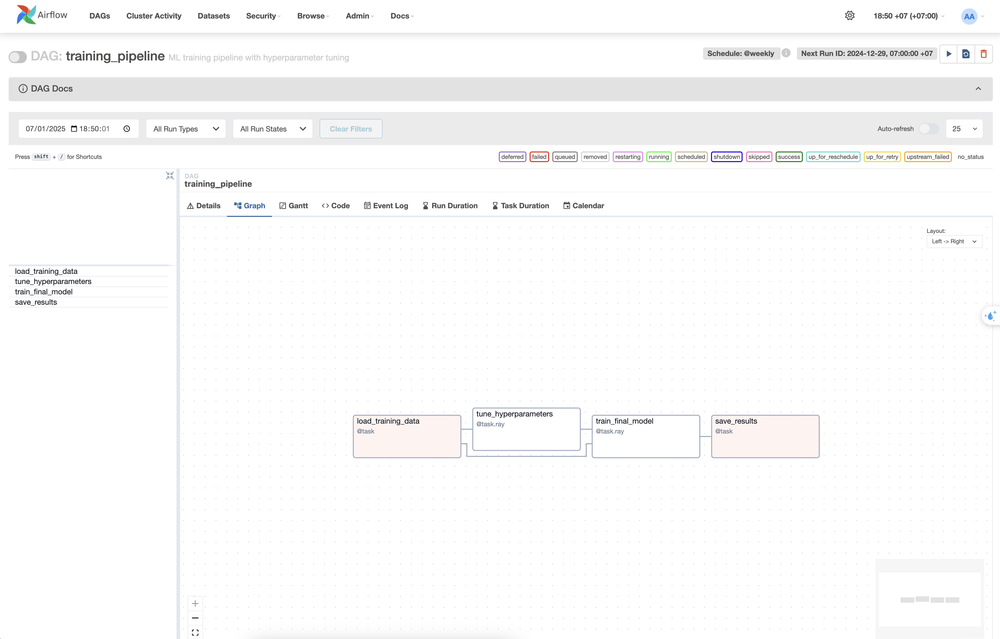

1. **Load Data** - Pulls processed data from the Data Warehouse for use in training the machine learning model.
2. **Tune Hyperparameters** - Utilizes Ray Tune to perform distributed hyperparameter tuning, optimizing the model's performance.
3. **Train Final Model** - Trains the final machine learning model using the best hyperparameters from the tuning phase.
4. **Save Results** - Saves the trained model and associated metrics to the Model Registry for future deployment and evaluation.

Trigger the `training_pipeline` DAG, and you should see the tasks running. This DAG will take some time to complete, but you can check the logs in the Airflow UI to see the progress.

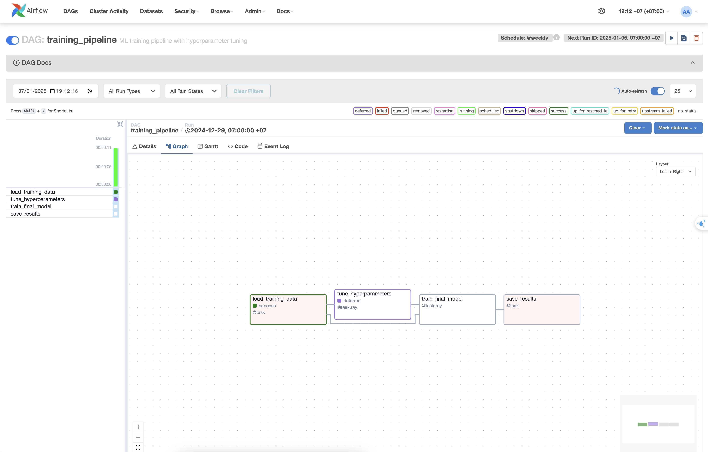

After hitting the `Trigger DAG` button, you should see the tasks running. The `tune_hyperparameters` task will be `deferred` because it will submit the Ray Tune job to the Ray Cluster and use polling to check if the job is done. The same happens with the `train_final_model` task.

When the `tune_hyperparameters` or `train_final_model` tasks are running, you can go to the Ray Dashboard at `localhost:8265` and you should see the tasks running.

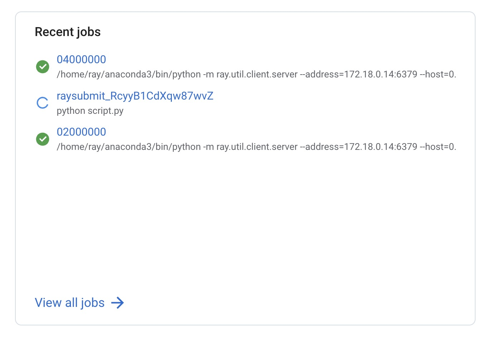

Click on the task and you should see the task details, including the id, status, time, logs, and more.

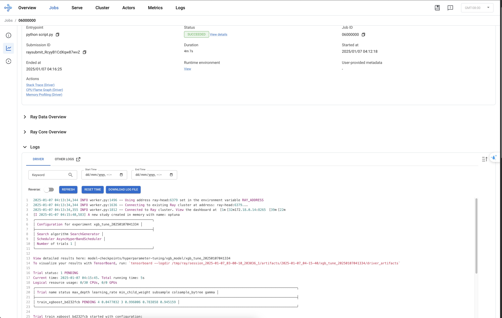

To see the results of the training, you can go to the MLflow UI at `localhost:5001` and you should see the training results.

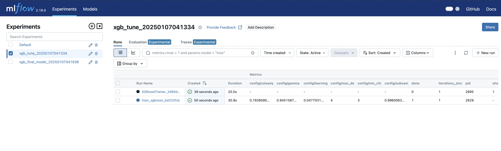

The model will be versioned in the Model Registry, you can go to `localhost:5001` and hit the `Models` tab and you should see the model.

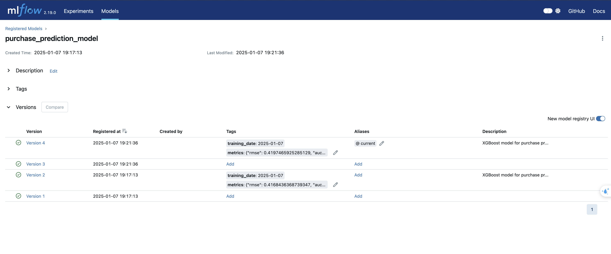
###  Start Serving Pipeline (7)

```bash
make up-serving
```

This command will start the Serving Pipeline. Note that we did not port forward the `8000` port in the `docker-compose.serving.yaml` file, but we just expose it. The reason is that we use Ray Serve, and the job will be submitted to the Ray Cluster. That is the reason why you see the port `8000` in the `docker-compose.serving.ray` file instead of the `docker-compose.serving.yaml` file.

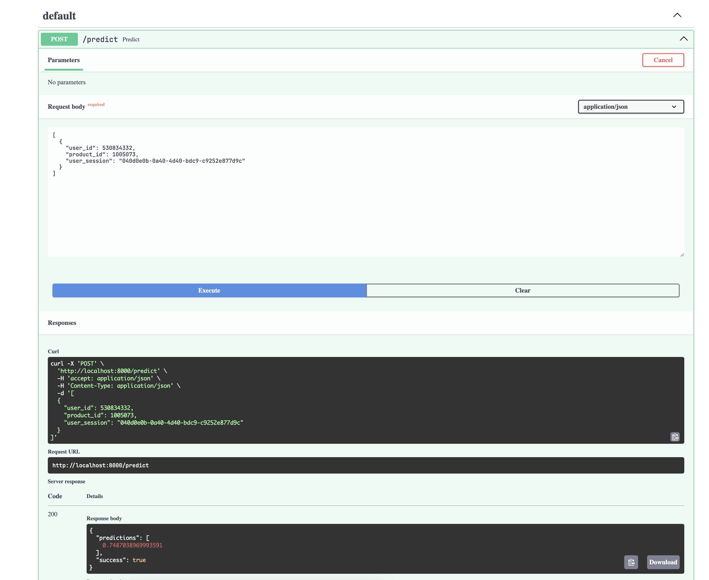

Currently, you have to manually restart the Ray Serve job (aka docker container) to load new model from the Model Registry. But in the future, I will add a feature to automatically load the new model from the Model Registry (Jenkins).

###  Start Observability (8)

####  SigNoz

```bash
make up-observability
```

This command will start the Observability Pipeline. This is a SigNoz instance that will receive the data from the OpenTelemetry Collector. Go to `localhost:3301` and you should see the SigNoz dashboard.

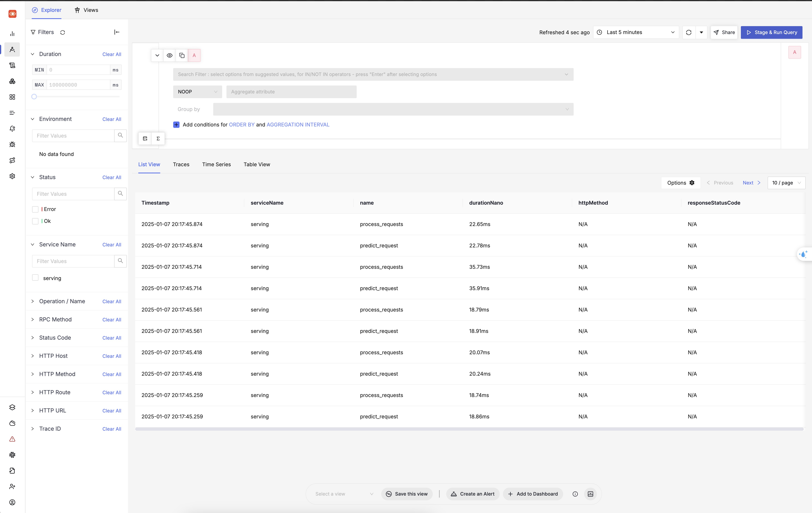

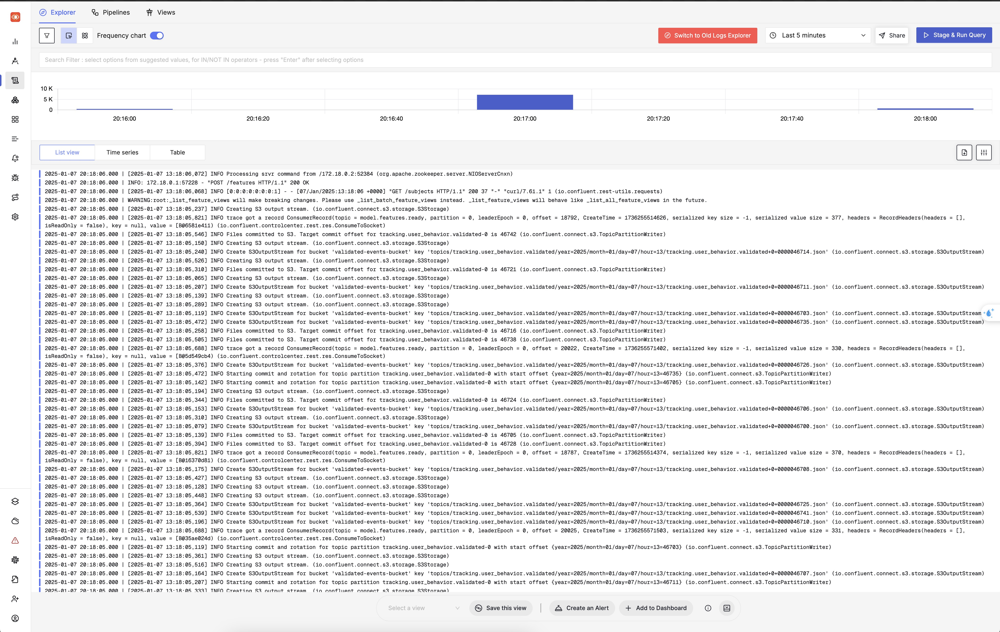

####  Prometheus and Grafana (9)

To see the Ray Cluster information, you can go to `localhost:3009` (user/password: `admin:admin`) and you should see the Grafana dashboard.

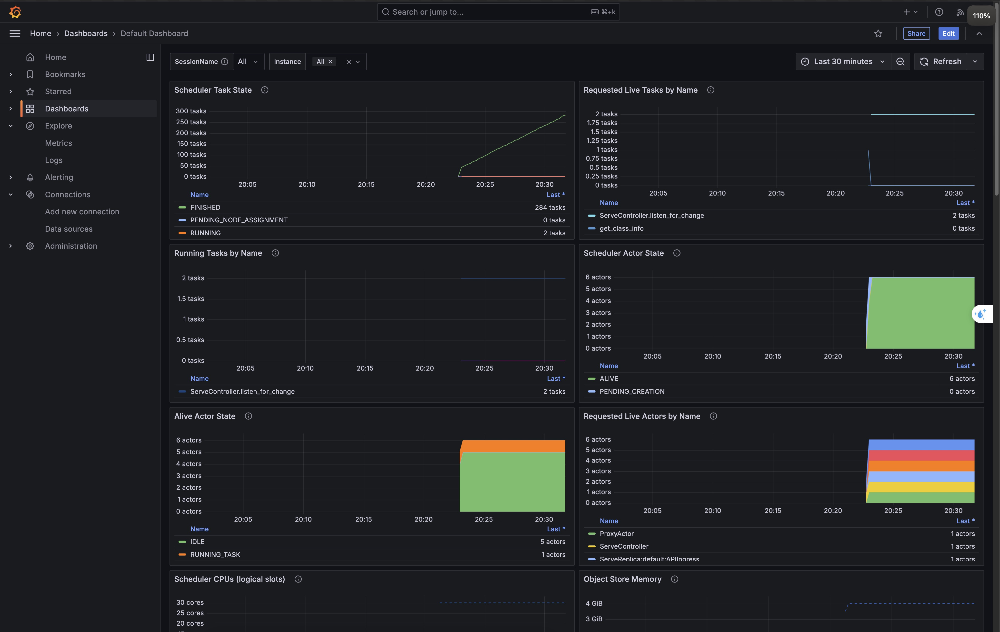

**Note**: If you dont see the dashboards, please remove the `tmp/ray` folder and then restart Ray Cluster and Grafana again.

###  NGINX (10)

```bash
make up-nginx
```

This command will start the **NGINX Proxy Manager**, which provides a user-friendly interface for configuring reverse proxies and SSL certificates. Access the UI at `localhost:81` using the default credentials:

- Username: `admin@example.com`
- Password: `changeme`

Key configuration options include:

- Free SSL certificate management using:
  - Let's Encrypt
  - Cloudflare SSL
- Free dynamic DNS providers:
  - [DuckDNS](https://www.duckdns.org/)
  - [YDNS](https://ydns.io/)
  - [FreeDNS](https://freedns.afraid.org/)
  - [Dynu](https://www.dynu.com/)
- Setting up reverse proxies for services like Signoz, Ray Dashboard, MLflow, and Grafana.

**Security Tip**: Change the default password immediately after first login to protect your proxy configuration.

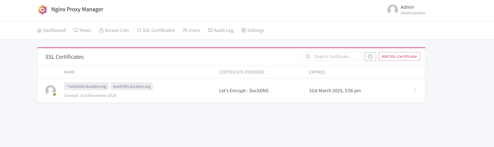

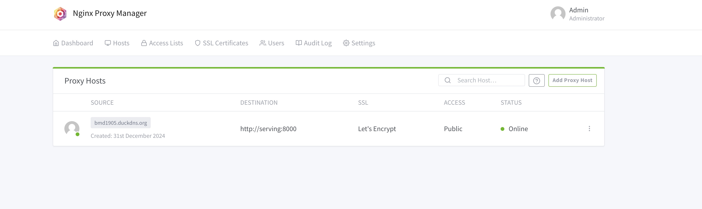

---

## Contributing

This project is open to contributions. Please feel free to submit a PR.

##  License

This project is provided under an MIT license. See the [LICENSE](LICENSE) file for details.
